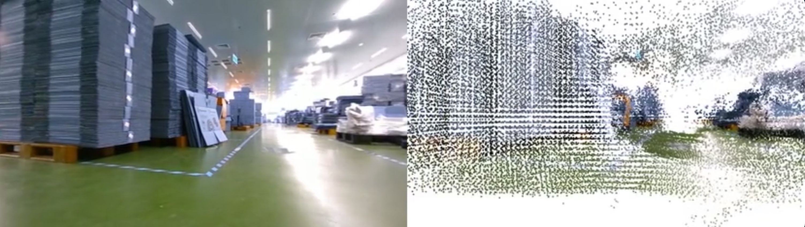
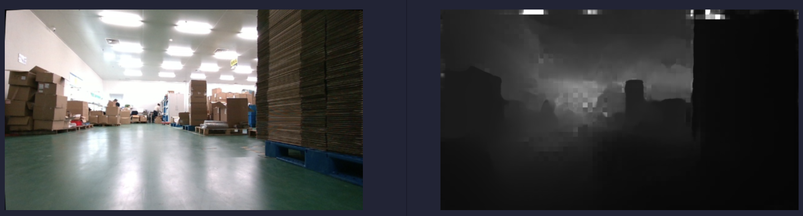
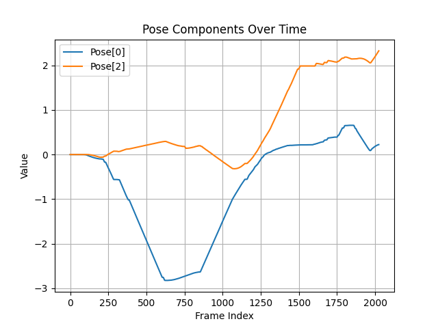
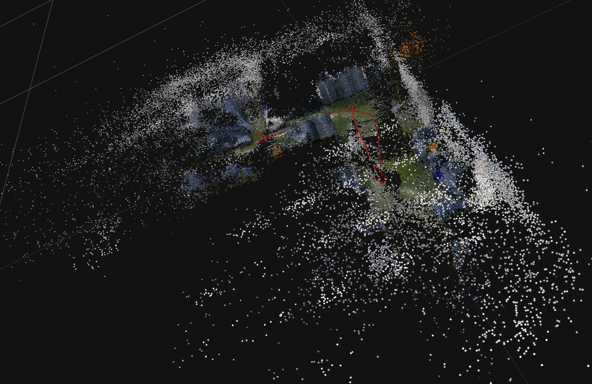

# Running DROID-SLAM on Warehouse Setting

[](https://www.youtube.com/watch?v=k6CitZy_zXI)

*The above picture is a link to our demo in YouTube.*

This work is built based on [DROID-SLAM: Deep Visual SLAM for Monocular, Stereo, and RGB-D Cameras](https://arxiv.org/abs/2108.10869). Thanks for their amazing work!

## Requirements

First, create an Anaconda environment `droidenv` following the instructions of [DROID-SLAM](https://github.com/princeton-vl/DROID-SLAM) repository. Since we do not require a GUI, you can just use `environment_novis.yaml`.

Then, ensure your working directory is the project repository, and run the following command.
```shell
conda activate droidenv
pip install matplotlib open3d==0.16.0
```

## Prepare Dataset
Due to copyright reasons, we cannot publish the original RGB videos that we use to run the algorithm on. 

If you are interested, modify these scripts to suit your videos! All you need are a monocular RGB video and a camera intrinsic matrix.

Put your camera intrinsic parameters, say `warehouse.txt`, to `calib`. Put your images, say `warehouse/frames*.jpg` to `data/`.

## Scritps 

### General Description 

Most of our scripts are used to visualize the results, which are all put in `work/`. 

Apart from that, we modify some code in `demo.py` and `droid_slam/visualization.py`. These two scripts are provided by the original repository. 

We will show how to run these scripts in the following. To know what will be produced after running each script and detailed commandline usage, please refer to comments in the header of each of these scripts. 

### Usage 

1. Generate point_clouds, disparity and estimated camera trajectory from a video. 
```shell 
python demo.py --imagedir=data/warehouse/ --calib=calib/warehouse.txt --stride=2 --reconstruction_path=warehouse --disable_vis
```

**All following scripts can only work properly after running `demo.py`**.

2. Convert disparity data to depth map. 
```shell 
python work/extractDepthImage.py --reconstruction_path=warehouse   
```

3. Print pose data in forms of tuples or matrices.
```shell
python work/readPose.py
```

4. To visualize how each component in the estimated pose change throughout the video. 
```shell 
python work/drawPoseComponent.py
```

5. To add camera trajectory (only locations at each frame, not including orientation) to point cloud file. 
```shell 
python work/combineCameraPose.py --setting=warehouse
```

6. Render observations of point clouds at estimated poses for each frame. 
```shell 
python work/generateImagesFromPly.py 
```

7. Generate video from images 
```shell 
ffmpeg -framerate 30 -i work/screen_capture/rendered_frames/frame_%04d.png -c:v libx264 -pix_fmt yuv420p work/point_cloud_video.mp4
```

## Some Visualization Results

### Demo Video 

Watch our results in https://www.youtube.com/watch?v=k6CitZy_zXI.

### Depth Map 

Generated by neural networks. 



### Pose Component Change 


 
### Trajectory in Point Clouds

The trajectory is marked by red dots.


## Acknowledgements
We thank [DROID-SLAM](https://github.com/princeton-vl/DROID-SLAM) for their amazing work again!
